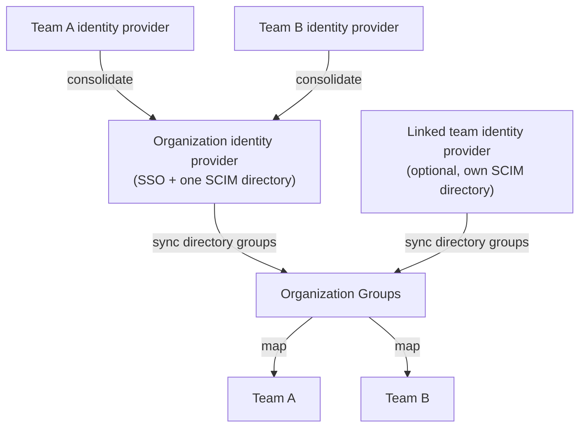

# Organizations

Organizations are the top-level container for Enterprise customers. They sit above teams and give you one place to manage shared identity, administration, and organization-wide settings.

## Organizations model

An Organization can include multiple teams, created around departments, business units, regions, or roles. Each team defines its own membership, roles, usage views, privacy settings, and usage controls. The Organization adds shared identity, administration, and org-wide settings on top.

Each Organization has a default team that acts as a stable home team for login and routing.

Users can belong to multiple teams in the same Organization, with a different role in each. One person can be an admin on one team, a member on another, and absent from a third.

## Identity model

Organizations give you one shared identity layer across every team. Configure how people sign in and how directory data flows into Cursor once, at the organization level, instead of repeating it per team.

### Single sign-on

Organizations support org-level SSO with your identity provider. This is the recommended model when you want one login setup across the company. Team-level SSO stays supported for team-specific identity requirements.

### Directory sync with SCIM

At the organization level, SCIM makes directory groups from your identity provider available to Cursor. Nothing syncs automatically: admins can be intentional and choose which directory groups to sync in as [Organization Groups](https://cursor.com/docs/enterprise/organization-groups.md), and those groups can then keep team membership aligned with your directory.

An identity provider connection supports one SCIM directory, so an Organization has one directory through its own identity provider. An Organization can still draw from more than one directory when linked teams run their own identity providers, since each of those connections can bring its own SCIM directory.

See [SCIM provisioning](https://cursor.com/docs/account/teams/scim.md) for setup and [Identity & access management](https://cursor.com/docs/enterprise/identity-and-access-management.md) for the full identity model.

### Consolidate team identity providers

Teams that set up their own identity provider before joining the Organization can consolidate into one shared setup. The result is a single organization identity provider instead of one configuration per team, and members keep signing in with the same corporate credentials.

To merge, open the Organization's **Settings**, find the team identity provider under **Identity provider**, and select **Merge into default IDP**.

The merge can't be undone: the team identity provider is retired and its teams use the organization default. Cursor runs the merge in the background, which can take a few minutes for large teams.

The identity model after consolidation: one organization identity provider handles login and directory sync for every team. A linked team that keeps its own identity provider contributes a second SCIM directory.

## Usage and contract boundaries

Usage is tracked at the team level for day-to-day reporting. With organization-pooled billing, teams can draw from a shared committed pool. See [Pooled usage](https://cursor.com/docs/enterprise/pooled-usage.md) for details.

## Groups

Organization Groups organize users across teams into org-wide cohorts such as Engineering, Contractors, or Pilot Users. Because members can belong to multiple teams, org admins can apply settings to the same cohort regardless of each user's team membership.

Groups can also drive team membership. Map a group to a team, and Cursor keeps that team's members and roles aligned with the cohort.

See [Organization Groups](https://cursor.com/docs/enterprise/organization-groups.md) for the full walkthrough: SCIM-synced setup, membership management, group settings, and team mappings.

## How limits and permissions combine

Users can pick up settings, such as spend limits and allowed models, from organization-level groups and team-level directory groups at once. Cursor reconciles them with a most-permissive-wins model.

For example, if a user is in an organization-level group and a team, Cursor uses the higher of the two spend limits.

| Layer                 | What it controls                         | How multiple sources combine                                                                 |
| --------------------- | ---------------------------------------- | -------------------------------------------------------------------------------------------- |
| Team default          | Baseline per-user spend caps             | Used only when nothing more specific is set                                                  |
| Per-user on team      | Override for one user                    | Wins over team defaults and directory group settings                                         |
| Directory Group(s)    | SCIM-synced spend caps and team policies | Spend limits use the highest value; policy behavior is generally most permissive             |
| Organization Group(s) | Org-level allowances and policy          | Across org groups, highest value applies; compared with team baseline, highest value applies |

Work bottom-up from least to most permissive: set the strictest defaults at the team level, then use Organization Groups to give specific cohorts more permissive settings.

## Roles

Organizations add org-level administration on top of team-level roles. Org admins manage organization settings, organization membership, shared identity configuration, and can view the Organization's teams. Team admins and team owners manage settings and members for their own teams.

Team admin access doesn't grant org admin access, and roles can differ by layer. A user can be an org admin while only being a member of specific teams.

## Organization API

For org-level automation, use the [Organization API](https://cursor.com/docs/account/organizations/organization-admin-api.md).

## Related docs

- [Enterprise overview](https://cursor.com/docs/enterprise.md)
- [Organization Groups](https://cursor.com/docs/enterprise/organization-groups.md)
- [Identity & access management](https://cursor.com/docs/enterprise/identity-and-access-management.md)
- [SCIM](https://cursor.com/docs/account/teams/scim.md)
- [Admin API](https://cursor.com/docs/account/teams/admin-api.md)
- [Billing groups](https://cursor.com/docs/account/enterprise/billing-groups.md)

---

## Sitemap

[Overview of all docs pages](/llms.txt)
